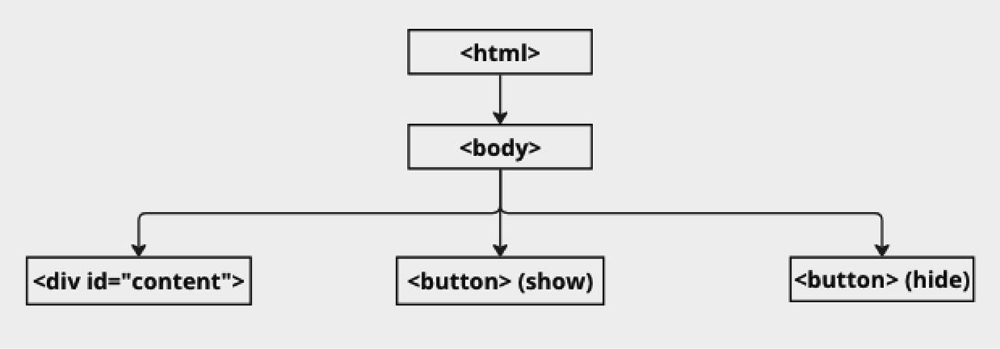
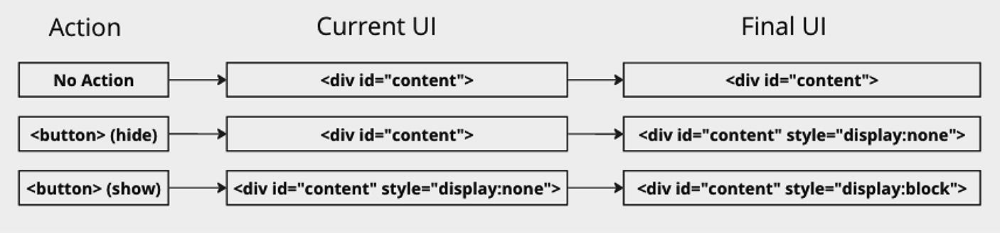

- [Objective](#objective)
- [JavaScript As an Interpreted Language](#javascript-as-an-interpreted-language)
- [The Role of JavaScript in Web Development](#the-role-of-javascript-in-web-development)
- [JavaScript and the Document Object Model (DOM)](#javascript-and-the-document-object-model-dom)
- [JavaScript Events and User Interaction](#javascript-events-and-user-interaction)
- [JavaScript in Front-End and Back-End Development](#javascript-in-front-end-and-back-end-development)

---

Reference[^1]

# Objective

`JavaScript` is a unique language designed specifically for the Web, giving developers the power to create interactive, dynamic websites that respond to user actions in real time. Its role in web development has expanded significantly since its creation, growing from a language used primarily for simple animations and effects to an essential tool for building robust enterprise applications that operate smoothly across devices.

---

# JavaScript As an Interpreted Language

> [!IMPORTANT]
> Unlike compiled languages, where code is converted into machine language before it runs, JavaScript is an **interpreted language**. 

This means JavaScript code is read and executed line by line directly by the browser’s JavaScript engine as it’s loaded on the web page.

When you load a web page containing JavaScript, the browser downloads the HTML, CSS, and JavaScript files from the server. The JavaScript code is then processed and executed by the browser’s JavaScript engine

---

# The Role of JavaScript in Web Development

JavaScript works in tandem with HTML and CSS, forming the foundational trio of front-end web development. Each of these technologies has a distinct role:

- **`HTML` (Hypertext Markup Language)** provides the structure of the page. It defines elements like headings, paragraphs, links, images, and other content.
- **`CSS` (Cascading Style Sheets)** defines the style of the page. It controls the layout, colors, fonts, and overall visual presentation.
- **`JavaScript`** is responsible for making the page interactive and dynamic. It allows developers to modify HTML and CSS in real time, respond to user actions, fetch data from servers, and more.

---

# JavaScript and the Document Object Model (DOM)

The **DOM (Document Object Model)** is an in-memory representation of an HTML document structured as a hierarchical tree.

Each element in HTML, such as a `<div>`, `<p>`, or ``, is represented as a node within the DOM tree. This structure allows JavaScript to access and manipulate page elements, making it possible to dynamically alter content, layout, and style in response to user actions.

For example, if a user clicks a button to open a menu, JavaScript can be used to modify the DOM by changing the button’s CSS classes, hiding or showing certain elements, or even adding new elements entirely. This ability to update the DOM in real time is one of JavaScript’s defining features and enables web pages to behave more like applications rather than static documents.

Some common DOM-related tasks that JavaScript can perform include:

- **Selecting Elements**: Using functions like document.getElementById() or document.querySelector(), JavaScript can access specific elements in the DOM.
- **Modifying Elements**: JavaScript can change an element’s properties, such as updating its text content, changing its CSS styles, or modifying its attributes.
- **Creating and Deleting Elements**: JavaScript can add new elements to the DOM, such as creating a new div or button, and it can also remove elements that are no longer needed.
- **Event Handling**: JavaScript can listen for events, such as clicks, keyboard input, or page loads, and perform specific actions in response.

Below is a simplified diagram of the DOM tree, which includes two buttons and a div element.



The workflow that follows depends on which button is clicked. In the first row, the user interface (UI) is shown in its initial state. When the “Hide” button is clicked (second row), the onclick event handler is triggered. This event adds a display: none style to the div, effectively hiding it from the UI. In the third row, the “Show” button is clicked, and the display: block style is applied to the div, making it visible again.



---

# JavaScript Events and User Interaction

> [!IMPORTANT]
> **Events** are actions that occur in the browser, such as mouse clicks, key presses, or the completion of a data load.

By “listening” for these events, JavaScript can respond to user input in real time. This allows for smooth, engaging user experiences, like real-time form validation, dynamic animations, or updating page content without reloading the page.

> [!TIP]
> Event handling is crucial for building interactive web applications. In JavaScript, developers use methods like addEventListener() to attach functions, known as event handlers, to specific events on HTML elements. Here’s a simple example:
> ```
> const button = document.querySelector('button');
> button.addEventListener('click', () => {
>  alert('Button clicked!');
> });
> ```

In this example, JavaScript waits for the user to click a button on the page. When the click event occurs, it triggers a function that displays an alert. This simple interaction demonstrates how JavaScript can connect user actions with custom behavior, creating a dynamic experience.

---

# JavaScript in Front-End and Back-End Development

> [!NOTE]
> Though JavaScript was originally designed for front-end development running in the browser to interact with the DOM, it has evolved to become a full-stack language capable of running on both the client (browser) and server (back end).

On the **client side**, JavaScript enables interactive web pages, user input handling, and the manipulation of HTML and CSS. It’s the language behind modern front-end frameworks like React, Angular, and Vue.js, which help developers build complex, single-page applications (SPAs) that offer a seamless user experience without page reloads.

In 2009, the introduction of Node.js extended JavaScript’s reach to **server-side development**. Node.js is a runtime environment that allows JavaScript code to execute outside of the browser, opening up new possibilities. With Node.js, developers can use JavaScript to handle back-end logic, connect to databases, serve APIs, and manage server resources.

---

[^1] Kapoor, S. (2025). Beginning JavaScript syntax : understanding syntactical rules and structures for better JavaScript programming. Apress. https://doi.org/10.1007/979-8-8688-1460-0