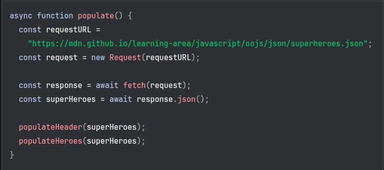
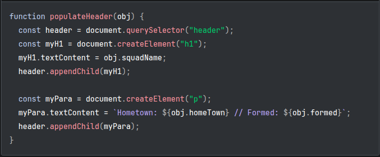
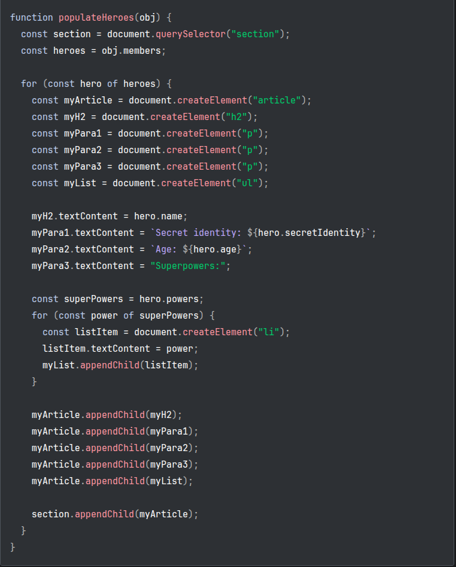
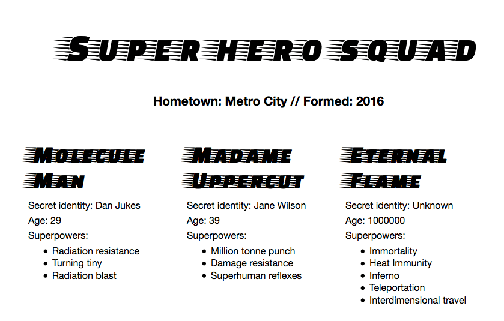

# JSON

JSON is a text-based data format following the JavaScript object syntax. It represents structured data as a string, which is useful when you want to transmit data across a network. Even though it closely resembles JavaScript object literal syntax, *it can be used independently from JavaScript*. Many programming environments feature the ability to read (parse) and generate JSON. In JavaScript, the methods for parsing and generating JSON are provided by the `JSON` object.

> [!NOTE]
> Converting a string to a native object is called **deserialization**, while converting a native object to a string so it can be transmitted across the network is called **serialization**.

A JSON string can be stored in its own file, which is basically just a text file with an extension of `.json`, and a [MIME type](https://developer.mozilla.org/en-US/docs/Glossary/MIME_type) of `application/json`.

## JSON structure

```
{
  "squadName": "Super hero squad",
  "homeTown": "Metro City",
  "formed": 2016,
  "secretBase": "Super tower",
  "active": true,
  "members": [
    {
      "name": "Molecule Man",
      "age": 29,
      "secretIdentity": "Dan Jukes",
      "powers": ["Radiation resistance", "Turning tiny", "Radiation blast"]
    },
    {
      "name": "Madame Uppercut",
      "age": 39,
      "secretIdentity": "Jane Wilson",
      "powers": [
        "Million tonne punch",
        "Damage resistance",
        "Superhuman reflexes"
      ]
    },
    {
      "name": "Eternal Flame",
      "age": 1000000,
      "secretIdentity": "Unknown",
      "powers": [
        "Immortality",
        "Heat Immunity",
        "Inferno",
        "Teleportation",
        "Interdimensional travel"
      ]
    }
  ]
}
```

> [!TIP]
> If you load this JSON in your JavaScript program as a string, you can parse it into a normal object and then access the data inside it using the same dot/bracket notation native to JavaScript syntax

```
const superHeroes = // paste JSON here
superHeroes.homeTown;
superHeroes.members[1].powers[2];
```

1. First, we have the variable name — `superHeroes`.
2. Inside that, we want to access the members property, so we use `.members`.
3. `members` contains an array populated by objects. We want to access the second object inside the array, so we use `[1]`.
4. Inside this object, we want to access the `powers` property, so we use `.powers`.
5. Inside the `powers` property is an array containing the selected hero's superpowers. We want the third one, so we use `[2]`.

> [!NOTE]
> The key takeaway is that there's really nothing special about working with JSON; after you've parsed it into a JavaScript object, you work with it just like you would with an object declared using the same object literal syntax.


## Arrays as JSON

> [!TIP]
> We can also convert arrays to/from JSON. The below example is perfectly valid JSON:

```
const superHeroes = [
  {
    "name": "Molecule Man",
    "age": 29,
    "secretIdentity": "Dan Jukes",
    "powers": ["Radiation resistance", "Turning tiny", "Radiation blast"]
  },
  {
    "name": "Madame Uppercut",
    "age": 39,
    "secretIdentity": "Jane Wilson",
    "powers": [
      "Million tonne punch",
      "Damage resistance",
      "Superhuman reflexes"
    ]
  }
]
```

You have to access array items (in its parsed version) by starting with an array index, for example `superHeroes[0].powers[0]`.

## JSON syntax restrictions

Any JSON is a valid JavaScript literal (`object`, `array`, `number`, etc.). The converse is not true, though—**not all JavaScript object literals are valid JSON**.

- JSON can only contain serializable data types. This means:
  - For primitives, JSON can contain string literals, number literals, `true`, `false`, and `null`. Notably, it cannot contain `undefined`, `NaN`, or `Infinity`.
  - For non-primitives, JSON can contain object literals and arrays, but not functions or any other object types, such as `Date`, `Set`, and `Map`. The objects and arrays inside JSON need to further contain valid JSON data types.
- Strings must be enclosed in double quotes, not single quotes.
- Numbers must be written in decimal notation.
- Each property of an object must be in the form of `"key": value`. Property names must be string literals enclosed in double quotes. Special JavaScript syntax, such as methods, is not allowed because methods are functions, and functions are not valid JSON data types.
- Objects and arrays cannot contain **trailing commas**.
- Comments are not allowed in JSON.

> [!IMPORTANT]
> Even a single misplaced comma or colon can make a JSON file invalid and cause it to fail. You should be careful to validate any data you are attempting to use
> You may validate JSON using a web application such as [JSONLint](https://jsonlint.com/) or [JSON-validate](https://www.json-validate.com/)

---

# Deliverable 05 - Consuming JSON to dynamically populate an HTML page

## I. Initial Setup

Start with the following files:

`index.html`
```
<!DOCTYPE html>
<html lang="en-US">
  <head>
    <meta charset="utf-8">
    <title>Deliverable 05 - Your Name Here</title>
    <link href="https://fonts.googleapis.com/css?family=Faster+One" rel="stylesheet">
    <link rel="stylesheet" href="css/style.css">
  </head>
  <body>
      <input type="button" id="load-btn">
      <header></header>
      <section></section>
      <script src="script.js"></script>      
  </body>
</html>
```

`css/style.css`
```
/* || general styles */

html {
  font-family: 'helvetica neue', helvetica, arial, sans-serif;
}

body {
  width: 800px;
  margin: 0 auto;
}

h1, h2 {
  font-family: 'Faster One', cursive;
}

/* header styles */

h1 {
  font-size: 4rem;
  text-align: center;
}

header p {
  font-size: 1.3rem;
  font-weight: bold;
  text-align: center;
}

/* section styles */

section article {
  width: 33%;
  float: left;
}

section p {
  margin: 5px 0;
}

section ul {
  margin-top: 0;
}

h2 {
  font-size: 2.5rem;
  letter-spacing: -5px;
  margin-bottom: 10px;
}
```

> [!IMPORTANT]
> We will be "fetching" JSON data from an external resource: https://mdn.github.io/learning-area/javascript/oojs/json/superheroes.json

`js/script.js`



To obtain the JSON, we use an API called `Fetch`. This API allows us to make network requests to retrieve resources from a server via JavaScript (e.g., images, text, JSON, even HTML snippets), meaning that we can update small sections of content without having to reload the entire page.

In our function, the first four lines use the Fetch API to fetch the JSON from the server:

- we declare the `requestURL` variable to store the GitHub URL
- we use the URL to initialize a new `Request` object.
- we make the network request using the `fetch()` function, and this returns a `Response` object
- we retrieve the response as JSON using the `json()` function of the `Response` object.

> [!NOTE]
> The `fetch()` API is asynchronous. You can learn about asynchronous functions in detail in our Asynchronous JavaScript module, but for now, we'll just say that we need to add the keyword `async` before the name of the function that uses the fetch API, and add the keyword `await` before the calls to any asynchronous functions.

After all that, the `superHeroes` variable will contain the JavaScript object based on the JSON. We are then passing that object to two function calls — the first one fills the `<header>` with the correct data, while the second one creates an information card for each hero on the team, and inserts it into the `<section>`.

## II. Populating the Header

Now that we've retrieved the JSON data and converted it into a JavaScript object, let's make use of it by writing the two functions we referenced above. First of all, add the following function definition below the previous code in `js/script.js`:



Here we first create an `h1` element with `createElement()`, set its `textContent` to equal the s`quadName` property of the object, then append it to the header using `appendChild()`. We then do a very similar operation with a paragraph: 

  1. create it, 
  2. set its text content and 
  3. append it to the header. 
  
The only difference is that its text is set to a template literal containing both the `homeTown` and `formed` properties of the object.

## III. Creating the hero information cards

Next, add the following function at the bottom of the code (in `js/script.js`), which creates and displays the superhero cards:



To start with, we store the `members` property of the JavaScript object in a new variable. This array contains multiple objects that contain the information for each hero.

Next, we use a `for...of` loop to iterate through each object in the array. For each one, we:

1. Create several new elements: an `<article>`, an `<h2>`, three `<p>`s, and a `<ul>`.
2. Set the `<h2>` to contain the current hero's name.
3. Fill the three paragraphs with their `secretIdentity`, `age`, and a line saying "Superpowers:" to introduce the information in the list.
4. Store the `powers` property in another new constant called `superPowers` — this contains an array that lists the current hero's superpowers.
5. Use another `for...of` loop to loop through the current hero's superpowers — for each one we create an `<li>` element, put the superpower inside it, then put the `listItem` inside the `<ul>` element (`myList`) using a`ppendChild()`.
6. The very last thing we do is to append the `<h2>`, `<p>`s, and `<ul>` inside the `<article>` (`myArticle`), then append the `<article>` inside the `<section>`. The order in which things are appended is important, as this is the order they will be displayed inside the HTML.

To wrap up this deliverable, and as the last line of `js/script.js`:

```
document.getElementById("load-btn").addEventListener("click", populate);
```

Final Output:



---
